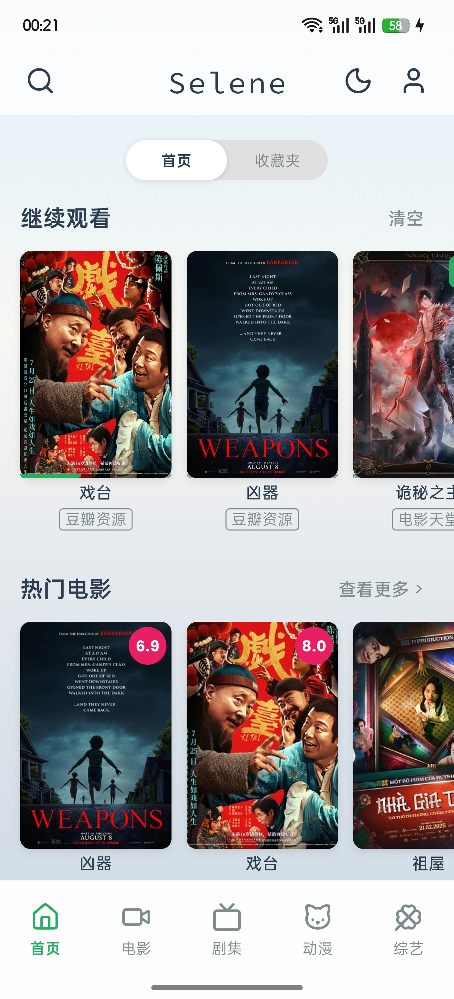
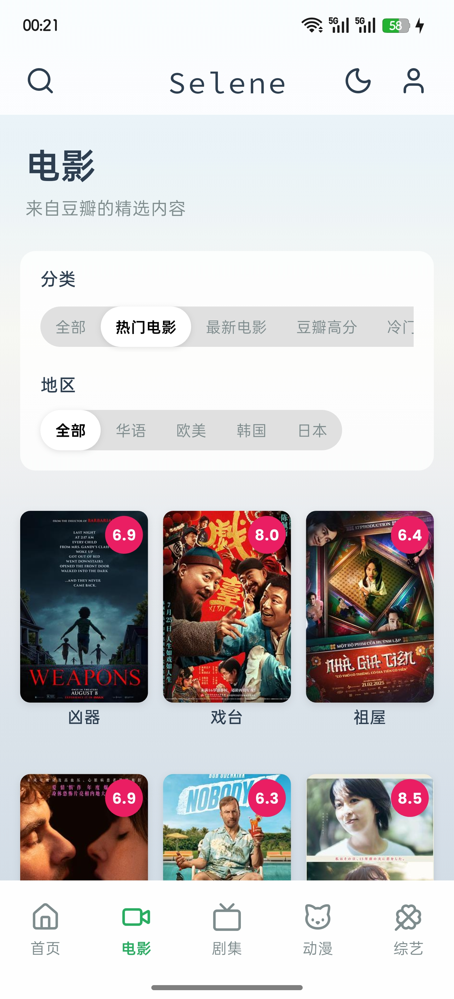
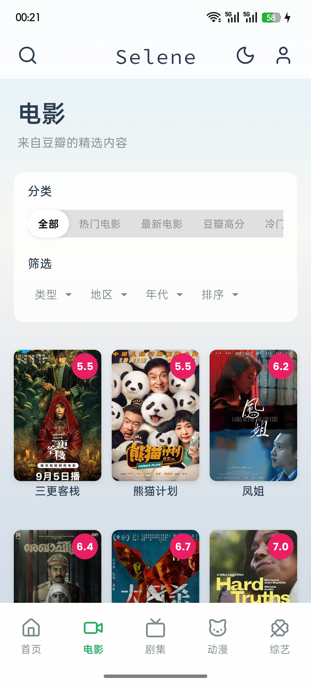
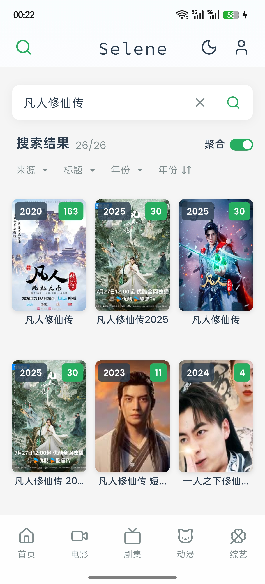
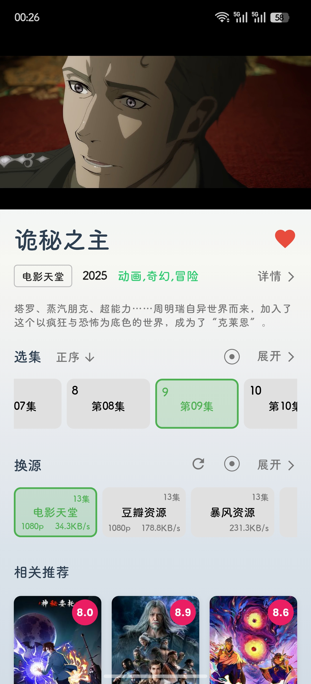
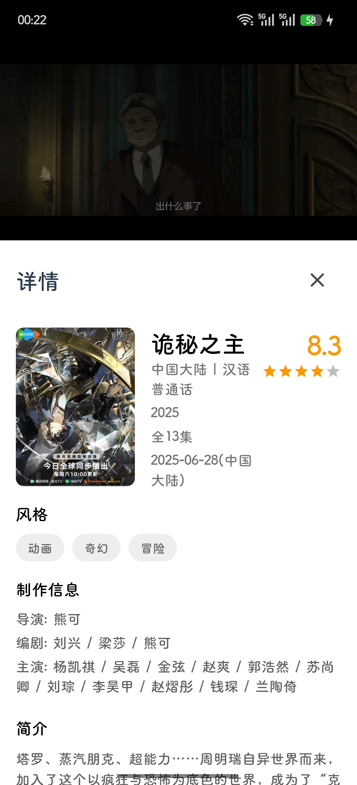

# Selene

  

> 🎬 **Selene** 是以 [MoonTV](https://github.com/MoonTechLab/LunaTV) v100 版本 / [Helios](https://github.com/MoonTechLab/Helios) 为后端的客户端，保证原汁原味的同时，优化了移动端操作体验。它基于 **Flutter** 构建，专为移动端打造，目前支持 Android-ArmV8 和 iOS 平台。

  
点击查看项目截图

  
  
  
  
  
  

### 请不要在 B站、小红书、微信公众号、抖音、今日头条或其他中国大陆社交平台发布视频或文章宣传本项目，不授权任何“科技周刊/月刊”类项目或站点收录本项目。

---

## ✨ 功能特性

### 🎯 核心功能
- **多源聚合搜索** - 支持多个视频源的聚合搜索，快速找到想看的内容
- **智能播放记录** - 自动记录播放进度，支持断点续播
- **个人收藏夹** - 收藏喜欢的影视作品，方便随时观看
- **多平台支持** - 支持电影、电视剧、动漫、综艺等多种内容类型

### 🎨 用户体验
- **现代化 UI** - 基于 Material Design 3 的现代化界面设计
- **深色模式** - 支持深色/浅色主题切换，护眼更舒适
- **流畅动画** - 丰富的交互动画，提升使用体验

### 🔧 技术特性
- **高性能播放** - 基于 FVP 播放器，支持多种视频格式
- **智能缓存** - 豆瓣数据缓存机制，提升加载速度
- **网络优化** - 支持 SSE 实时搜索，响应更迅速

## 📱 支持平台

- **Android** - 最低支持 Android 5.0 (API 21)
- **iOS** - 最低支持 iOS 12.0

## 📖 使用说明

### 首次使用
1. 启动应用后，系统会自动检查登录状态
2. 如未登录，会跳转到登录页面
3. 登录成功后进入主界面

### 主要功能
- **首页** - 查看热门内容、继续观看、个人收藏
- **搜索** - 多源聚合搜索，支持实时搜索建议
- **分类浏览** - 按电影、电视剧、动漫、综艺分类浏览
- **播放器** - 支持多种播放控制，自动记录播放进度

## 🏗️ 技术架构

### 核心技术栈
- **Flutter** - 跨平台 UI 框架
- **Dart** - 编程语言
- **Provider** - 状态管理
- **Dio** - HTTP 网络请求
- **FVP** - 视频播放器

## ⚠️ 免责声明

**重要提醒：**

1. **仅供学习交流** - 本项目仅用于技术学习和交流目的，不提供任何商业服务。

2. **内容来源** - 本应用聚合的内容来源于第三方平台，我们不对内容的合法性、准确性、完整性或可用性承担任何责任。

3. **版权声明** - 所有影视内容的版权归原作者和版权方所有，请用户自觉遵守相关法律法规，支持正版。

4. **使用风险** - 用户使用本应用所产生的任何直接或间接损失，开发者不承担任何责任。

5. **合规使用** - 请用户在使用过程中遵守当地法律法规，不得用于任何违法用途。

6. **数据安全** - 虽然我们重视用户隐私，但请用户自行承担数据安全风险。

**使用本应用即表示您已阅读并同意上述免责声明。**

## 🙏 致谢

- [MoonTV](https://github.com/MoonTechLab/LunaTV) - 后端服务支持
- [Flutter](https://flutter.dev/) - 跨平台开发框架
- 所有用户的支持
---

  
如果这个项目对您有帮助，请给个 ⭐️ 支持一下！

